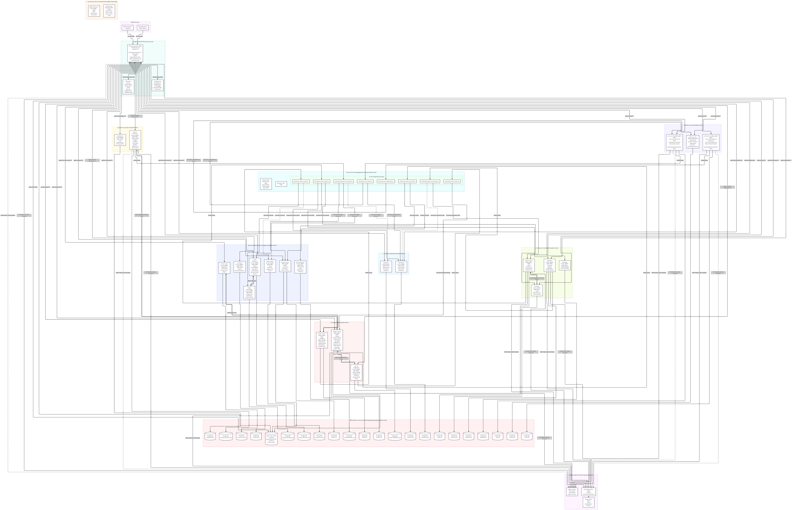
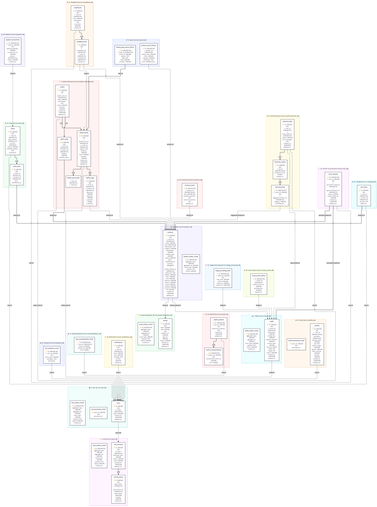

# 📖 FashionPin Enterprise Backend — Architecture & Engineering Book

<div align="center">


<p align="center">
  <b>A Cloud-Native, Event-Driven Luxury Visual Fashion Discovery, Headless Commerce & GenAI Platform</b><br/>
  <i>Engineered with 20+ Distributed Microservices, Database-per-Service Isolation, High-Throughput gRPC, Apache Kafka Event Bus, and Orchestrated on Contabo Cloud VPS.</i>
</p>

</div>

---

## 📑 Table of Contents
1. [Executive Overview & Engineering Philosophy](#-1-executive-overview--engineering-philosophy)
2. [High-Level System Architecture](#-2-high-level-system-architecture)
3. [Database-Per-Service Architecture & Entity Relationship Diagram (ERD)](#-3-database-per-service-architecture--entity-relationship-diagram-erd)
4. [Event-Driven Architecture with Apache Kafka](#-4-event-driven-architecture-with-apache-kafka)
5. [High-Speed Caching & Edge Rate Limiting with Redis](#-5-high-speed-caching--edge-rate-limiting-with-redis)
6. [Hybrid Synchronous Communication: gRPC & Reactive REST](#-6-hybrid-synchronous-communication-grpc--reactive-rest)
7. [Cloud-Native S3 Object Storage with MinIO](#-7-cloud-native-s3-object-storage-with-minio)
8. [Full-Stack SSLCommerz v4 Payment Gateway Integration](#-8-full-stack-sslcommerz-v4-payment-gateway-integration)
9. [Artificial Intelligence, Computer Vision & Virtual Try-On](#-9-artificial-intelligence-computer-vision--virtual-try-on)
10. [Comprehensive Microservices & Port Registry](#-10-comprehensive-microservices--port-registry)
11. [Contabo Cloud VPS Orchestration & Systems Engineering](#-11-contabo-cloud-vps-orchestration--systems-engineering)
12. [Observability, Telemetry & Distributed Tracing](#-12-observability-telemetry--distributed-tracing)
13. [High-Scale Blueprint: Engineered for 4 Million+ Users](#-13-high-scale-blueprint-engineered-for-4-million-users)
14. [Local Developer Quickstart & Configuration](#-14-local-developer-quickstart--configuration)

---

## 🏛️ 1. Executive Overview & Engineering Philosophy

**FashionPin** is an enterprise-grade ecosystem engineered to solve the complex intersection of high-fidelity visual social discovery (Pinterest-style aesthetic feeds) and headless luxury commerce.

### Core Architectural Tenets
- **Strict Domain-Driven Design (DDD)**: Each business domain is encapsulated in an autonomous microservice with isolated business logic and explicit bounded contexts.
- **Database-per-Service Pattern**: Complete data segregation across 20+ dedicated PostgreSQL databases. No cross-service SQL joins; inter-service communication is conducted strictly over gRPC or Kafka.
- **Event-Driven Resilience**: Transactional Outbox Pattern coupled with idempotent consumer handlers to guarantee at-least-once message delivery without distributed database transactions.
- **Defense-in-Depth Perimeter**: A reactive API Gateway terminating TLS, enforcing JWT claims, managing Redis token-bucket rate limits, and proxying requests into an internal zero-trust container network.
- **Production-Ready Memory Engineering**: Tuned specifically to run more than 30 microservices and infrastructure containers reliably on resource-managed Cloud VPS instances.

---

## 🌐 2. High-Level System Architecture

The platform follows a multi-tiered distributed topology separating the client experience layer, edge security perimeter, isolated domain microservices, and asynchronous event infrastructure.

### Complete System Architecture Diagram


### Architectural Flowchart

```mermaid
flowchart TD
    subgraph Clients ["1. Client & Experience Layer"]
        Web["Next.js 14 Web Storefront (:3000)"]
        Mobile["Flutter Mobile App (iOS / Android)"]
        Admin["Brand & Atelier Admin Portal (:3001)"]
    end

    subgraph Perimeter ["2. Edge & Security Perimeter"]
        Gateway["Spring Cloud API Gateway (:8080)<br/>• Global JWT Verification<br/>• Redis Rate Limiter<br/>• Swagger UI Aggregator Hub"]
        Eureka["Netflix Eureka Registry (:8761)<br/>• Dynamic Mesh Heartbeats"]
        Config["Config Server (:8888)<br/>• Centralized Configurations"]
    end

    subgraph Microservices ["3. Isolated Domain Microservices (REST + gRPC)"]
        direction TB
        AuthSvc["auth-service (:8081 | gRPC: 9081)"]
        UserSvc["user-service (:8082 | gRPC: 9082)"]
        ProfileSvc["profile-service (:8083 | gRPC: 9083)"]
        DiscoverySvc["fashion-discovery-service (:8086 | gRPC: 9086)"]
        ProductSvc["product-service (:8085 | gRPC: 9085)"]
        SearchSvc["search-service (:8088 | gRPC: 9088)"]
        RecSvc["recommendation-service (:8087 | gRPC: 9087)"]
        OutfitSvc["outfit-detection-service (:8087 | gRPC: 9087)"]
        ImageSvc["image-processing-service (:8089 | gRPC: 9089)"]
        VisualSearchSvc["visual-search-service (:8089 | gRPC: 9089)"]
        AIStylistSvc["ai-stylist-service (:8091 | gRPC: 9091)"]
        VirtualTryonSvc["virtual-tryon-service (:8092 | gRPC: 9092)"]
        MoodboardSvc["moodboard-service (:8093 | gRPC: 9093)"]
        ShoppingSvc["shopping-service (:8094 | gRPC: 9094)"]
        OrderSvc["order-service (:8095 | gRPC: 9095)"]
        PaymentSvc["payment-service (:8096 | gRPC: 9096)"]
        InventorySvc["inventory-service (:8097 | gRPC: 9097)"]
        BrandSvc["brand-integration-service (:8098 | gRPC: 9098)"]
        NotificationSvc["notification-service (:8099 | gRPC: 9099)"]
        AnalyticsSvc["analytics-service (:8100 | gRPC: 9100)"]
        MediaSvc["media-service (:8101 | gRPC: 9101)"]
    end

    subgraph Infrastructure ["4. Persistence, Caching & Event Mesh"]
        PostgresCluster[("PostgreSQL 16 Cluster<br/>(21 Dedicated Schema DBs)")]
        RedisCluster[("Redis 7.2 In-Memory<br/>(Cache & Token Bucket)")]
        KafkaCluster[("Apache Kafka & Zookeeper<br/>(Event Streams & Outbox Relay)")]
        MinIOCluster[("MinIO S3 Object Storage<br/>(Media & CDN Buckets)")]
        ObservabilityCluster["Observability Suite<br/>(Prometheus :9090 · Grafana :3000 · Zipkin :9411)"]
    end

    Clients -->|HTTPS / REST| Gateway
    Gateway --> Eureka
    Gateway --> Config
    Gateway --> Microservices
    Microservices <-->|gRPC Protobuf Channels :9081-:9101| Microservices
    Microservices --> PostgresCluster
    Microservices --> RedisCluster
    Microservices --> MinIOCluster
    Microservices -.->|Publish / Consume Events| KafkaCluster
    ObservabilityCluster -.->|Metrics Scrape & Spans| Microservices
```


---

## 🗄️ 3. Database-Per-Service Architecture & Entity Relationship Diagram (ERD)

To eliminate distributed database lock contention, schema fragility, and cross-team coupling, **FashionPin strictly adheres to the Database-per-Service pattern**.

### Entity Relationship Diagram (ERD)


### Dedicated Database Topology
Each microservice is provisioned with its own schema and credentials, preventing accidental cross-boundary queries:

| Database Name | Microservice Owner | Core Entities & Domain Data |
| :--- | :--- | :--- |
| `auth_db` | `auth-service` | User accounts, credentials, refresh tokens, security audit logs |
| `user_db` | `user-service` | User core demographics, contact info, security flags |
| `profile_db` | `profile-service` | Atelier bios, style DNA, follower/following social graph |
| `product_db` | `product-service` | Product catalog, SKUs, sizes, colors, categories, materials |
| `fashion_discovery_db` | `fashion-discovery-service`| Visual pin feed, style tags, curated collections, board pins |
| `search_db` | `search-service` | Inverted catalog search indices, autocomplete keywords |
| `recommendation_db` | `recommendation-service` | User aesthetic vectors, collaborative filtering affinities |
| `outfit_detection_db` | `outfit-detection-service` | Garment segmentation masks, detected bounding boxes |
| `image_processing_db` | `image-processing-service` | Color extraction palettes, aspect ratio conversions |
| `visual_search_db` | `visual-search-service` | Deep vector embeddings for reverse image lookups |
| `ai_stylist_db` | `ai-stylist-service` | Stylist chat sessions, conversational prompt history |
| `virtual_tryon_db` | `virtual-tryon-service` | Try-on task logs, rendered garment outputs, mask caches |
| `moodboard_db` | `moodboard-service` | Curated boards, moodboard canvas items, collaborator access |
| `shopping_db` | `shopping-service` | Active shopping carts, line items, saved wishlists |
| `order_db` | `order-service` | Order header, order items, state machine transitions, shipping |
| `payment_db` | `payment-service` | Payment transactions, SSLCommerz session logs, ledger ledger |
| `inventory_db` | `inventory-service` | Real-time SKU stock levels, warehouse reservations, stock locking |
| `brand_integration_db` | `brand-integration-service`| B2B brand partners, designer ateliers, inventory sync webhooks |
| `notification_db` | `notification-service` | In-app alerts, push notifications, read/unread states |
| `analytics_db` | `analytics-service` | Clickstream logs, impression telemetry, GMV revenue metrics |
| `media_db` | `media-service` | S3 asset metadata, upload audit trails, MIME validation logs |

### Schema Migration & Connection Pool Optimization
- **Flyway Declarative Migrations**: Every service automatically checks and applies versioned migrations (`V1__init_schema.sql`, `V2__...`) at boot time.
- **HikariCP Pool Sizing**: Configured with explicit `maximum-pool-size: 10`, `minimum-idle: 2`, and `connection-timeout: 20000ms` per service. With 21 services running on PostgreSQL 16, this caps total concurrent connections under 250, ensuring absolute stability without exhausting VPS socket descriptors.

---

## ⚡ 4. Event-Driven Architecture with Apache Kafka

Asynchronous communication and inter-service synchronization are powered by **Apache Kafka**.

```
┌─────────────────┐       1. Write Entity + Event       ┌────────────────────────┐
│  auth-service   │ ──────────────────────────────────> │  outbox_events (DB)    │
└─────────────────┘                                     └────────────────────────┘
         │                                                           │
         │ (DB Commit)                                               │ 2. Poll pending
         ▼                                                           ▼
┌─────────────────┐                                     ┌────────────────────────┐
│ PostgreSQL 16   │                                     │ OutboxPublisherService │
└─────────────────┘                                     └────────────────────────┘
                                                                     │
                                                                     │ 3. Publish
                                                                     ▼
                                                        ┌────────────────────────┐
                                                        │  Apache Kafka Broker   │
                                                        │  (Topic: user.reg.v1)  │
                                                        └────────────────────────┘
                                                                     │
                                                                     │ 4. Consume
                                                                     ▼
                                                        ┌────────────────────────┐
                                                        │      user-service      │
                                                        │ (Idempotency Verifier) │
                                                        └────────────────────────┘
```

### 1. Transactional Outbox Pattern
To prevent dual-write inconsistencies between the local database and the Kafka cluster:
1. When an operation occurs (e.g. user registration), the entity update and an outbox event record are written to the database **in a single atomic SQL transaction**.
2. A background worker (`OutboxPublisherScheduler`) polls unprocessed outbox events every 2 seconds.
3. Once successfully published to Kafka, the record is marked `PROCESSED`. If Kafka is momentarily unavailable, events remain safely persisted in the database until network recovery.

### 2. Idempotent Consumer Pattern
Consumers prevent duplicate processing caused by network re-transmissions:
- Before executing business logic, the consumer checks the `processed_events` table for `event_id`.
- If already processed, the message is acknowledged and skipped immediately.
- The state mutation and insertion into `processed_events` execute inside the consumer's local database transaction.

### Kafka Event Directory (`common-lib`)
Defined centrally in `com.fashionpin.common.kafka.KafkaTopics`:
- `fashionpin.user.registered.v1`: Broadcast when a user registers; consumed by `user-service`.
- `fashionpin.user.created.v1`: Broadcast when a user profile is provisioned; consumed by `profile-service`.
- `fashionpin.order.created.v1`: Broadcast by `order-service`; triggers stock locking in `inventory-service` and ledger creation in `payment-service`.
- `fashionpin.payment.processed.v1`: Signals payment completion to update order status and initiate fulfillment.

---

## 🚀 5. High-Speed Caching & Edge Rate Limiting with Redis

**Redis 7.2** is utilized across the platform for two critical operational purposes:

### 1. Edge Token-Bucket Rate Limiter
Spring Cloud Gateway integrates with Redis via `RedisRateLimiter` to protect backend services against abuse and DDoS:
- **Replenish Rate**: 20 requests per second per IP/User.
- **Burst Capacity**: 40 requests per second.
- **Key Resolver**: Extracts client IP or authenticated JWT principal (`X-User-Id`).

### 2. Cache-Aside Pattern
Frequently read, low-mutation data is cached in Redis with designated TTLs:
- **Taxonomy & Category Trees**: Cached with a 6-hour TTL in `fashion-discovery-service` and `product-service`.
- **User Permission Claims**: Cached with a 15-minute TTL to accelerate gateway JWT filter passes.
- **Session Tokens**: Fast revocation verification.

---

## ⚡ 6. Hybrid Synchronous Communication: gRPC & Reactive REST

FashionPin blends external REST openness with internal high-performance binary RPC:

```
                       ┌────────────────────────────────────────────────────────┐
                       │                   API Gateway (:8080)                  │
                       └────────────────────────────────────────────────────────┘
                                            │                 │
                                    REST    │                 │ REST
                                            ▼                 ▼
                                    ┌──────────────┐   ┌──────────────┐
                                    │ auth-service │   │ user-service │
                                    │    :8081     │   │    :8082     │
                                    └──────────────┘   └──────────────┘
                                            ▲                 │
                                            │   gRPC Channel  │
                                            └── (:9081-:9082) ┘
```

- **North-South (Client-to-Gateway)**: Standard RESTful JSON APIs compliant with OpenAPI 3.0 specifications.
- **East-West (Service-to-Service)**: High-speed **gRPC channels** with Protobuf contracts on dedicated secondary ports (`9081` through `9101`).
  - **Zero Serialization Overhead**: Binary Protobuf serialization yields up to 7x faster serialization compared to JSON.
  - **HTTP/2 Multiplexing**: Multiple parallel RPC requests are multiplexed across a single long-lived TCP connection, slashing TCP handshake latencies.

---

## 🪣 7. Cloud-Native S3 Object Storage with MinIO

To handle vast volumes of high-resolution fashion media, lookbooks, and AI masks, FashionPin features dedicated **MinIO S3-Compatible Object Storage**:

- **S3 API Port**: `:9000`
- **MinIO Console Port**: `:9001`
- **Storage Adapter**: Implemented in [`media-service`](file:///Users/sajid/Documents/FashionPinFullStack/FashionPinBackend/media-service) via [`S3ObjectStorageAdapter.java`](file:///Users/sajid/Documents/FashionPinFullStack/FashionPinBackend/media-service/src/main/java/com/fashionpin/mediaservice/storage/S3ObjectStorageAdapter.java).
- **Auto-Provisioned Dedicated Buckets**:
  - `fashionpin-media`: General user attachments and uploads.
  - `fashionpin-products`: Luxury catalog photography and high-res garment assets.
  - `fashionpin-pins`: Social Pinterest-style pins, moodboards, and tags.
  - `fashionpin-avatars`: User avatars and atelier banners.
  - `fashionpin-tryon`: AI-generated virtual try-on renders and segmented masks.

---

## 💳 8. Full-Stack SSLCommerz v4 Payment Gateway Integration

The backend implements end-to-end payment processing in [`payment-service`](file:///Users/sajid/Documents/FashionPinFullStack/FashionPinBackend/payment-service) for Bangladesh's leading payment gateway, **SSLCommerz v4 API**:

### Architecture & Callbacks
1. **Payment Session Initialization**:
   - `POST /api/v1/payment/initiate`: Sends customer details, order reference, and amount to SSLCommerz API (`https://sandbox.sslcommerz.com/gwprocess/v4/api.php`).
   - Receives and returns `GatewayPageURL` to the client for redirecting users to the payment portal.
2. **Server-to-Server IPN Callbacks**:
   - `POST /api/v1/payment/success`: Handles successful authorization; queries the SSLCommerz Validator API server-to-server to guarantee legitimacy before issuing order confirmation.
   - `POST /api/v1/payment/fail`: Handles declined transactions.
   - `POST /api/v1/payment/cancel`: Handles user cancellations.
3. **Security Configurations**:
   - CSRF bypass explicitly configured for payment webhook routes in [`SecurityConfig.java`](file:///Users/sajid/Documents/FashionPinFullStack/FashionPinBackend/payment-service/src/main/java/com/fashionpin/paymentservice/security/SecurityConfig.java).
   - Dynamic credential binding: `SSLCOMMERZ_STORE_ID` and `SSLCOMMERZ_STORE_PASSWORD` are loaded strictly via environment variables.

---

## 🤖 9. Artificial Intelligence, Computer Vision & Virtual Try-On

FashionPin incorporates cutting-edge AI microservices directly into the microservice fabric:

1. **`ai-stylist-service` (:8091)**:
   - Intelligent GenAI conversational assistant.
   - Generates contextual fashion recommendations based on user wardrobe history, style preferences, and seasonal trends.
2. **`virtual-tryon-service` (:8092)**:
   - Built on FastAPI with PyTorch diffusion pipelines.
   - Accepts human model images and garment cutouts to generate photorealistic virtual fitting room previews.
3. **`outfit-detection-service` (:8087)**:
   - Automated computer vision segmentation.
   - Detects garments within uploaded pins and breaks them down into individual shoppable product tags.
4. **`visual-search-service` (:8089)**:
   - Generates deep image vector embeddings.
   - Performs cosine similarity lookups against the product catalog to enable "Shop the Look" image search.

---

## 📋 10. Comprehensive Microservices & Port Registry

The complete fleet consists of 24 interconnected services and infrastructure components:

| # | Service Name | Domain | REST Port | gRPC Port | Dedicated DB | Health Endpoint | Direct Swagger UI Link |
| :-: | :--- | :--- | :-: | :-: | :--- | :--- | :--- |
| **0** | **api-gateway** | Edge Perimeter & Router | `8080` | — | — | `/actuator/health` | [Swagger Hub :8080](http://<SERVER_IP>:8080/swagger-ui.html) |
| **1** | **discovery-service** | Eureka Registry | `8761` | — | — | `/eureka/apps` | Eureka Dashboard |
| **2** | **config-server** | Cloud Configuration | `8888` | — | — | `/actuator/health` | Config API |
| **3** | **auth-service** | Identity & Security | `8081` | `9081` | `auth_db` | `/actuator/health` | [Swagger :8081](http://<SERVER_IP>:8081/swagger-ui/index.html) |
| **4** | **user-service** | Accounts & Users | `8082` | `9082` | `user_db` | `/actuator/health` | [Swagger :8082](http://<SERVER_IP>:8082/swagger-ui/index.html) |
| **5** | **profile-service** | Social Graph & Style DNA | `8083` | `9083` | `profile_db` | `/actuator/health` | [Swagger :8083](http://<SERVER_IP>:8083/swagger-ui/index.html) |
| **6** | **fashion-discovery-service** | Visual Feed & Pins | `8086` | `9086` | `fashion_discovery_db`| `/actuator/health` | [Swagger :8086](http://<SERVER_IP>:8086/swagger-ui/index.html) |
| **7** | **product-service** | Catalog & SKUs | `8085` | `9085` | `product_db` | `/actuator/health` | [Swagger :8085](http://<SERVER_IP>:8085/swagger-ui/index.html) |
| **8** | **search-service** | Catalog Search | `8088` | `9088` | `search_db` | `/actuator/health` | [Swagger :8088](http://<SERVER_IP>:8088/swagger-ui/index.html) |
| **9** | **recommendation-service**| Personalization AI | `8087` | `9087` | `recommendation_db` | `/actuator/health` | [Swagger :8087](http://<SERVER_IP>:8087/swagger-ui/index.html) |
| **10**| **outfit-detection-service**| AI Garment Segmentation | `8087` | `9087` | `outfit_detection_db`| `/actuator/health` | [Swagger :8087](http://<SERVER_IP>:8087/swagger-ui/index.html) |
| **11**| **image-processing-service**| Media Pipeline | `8089` | `9089` | `image_processing_db`| `/actuator/health` | [Swagger :8089](http://<SERVER_IP>:8089/swagger-ui/index.html) |
| **12**| **visual-search-service** | Vector Similarity | `8089` | `9089` | `visual_search_db` | `/actuator/health` | [Swagger :8089](http://<SERVER_IP>:8089/swagger-ui/index.html) |
| **13**| **ai-stylist-service** | GenAI Stylist Chat | `8091` | `9091` | `ai_stylist_db` | `/actuator/health` | [Swagger :8091](http://<SERVER_IP>:8091/swagger-ui/index.html) |
| **14**| **virtual-tryon-service** | AI Fitting Room | `8092` | `9092` | `virtual_tryon_db` | `/actuator/health` | [Swagger :8092](http://<SERVER_IP>:8092/swagger-ui/index.html) |
| **15**| **moodboard-service** | Visual Curation & Pins | `8093` | `9093` | `moodboard_db` | `/actuator/health` | [Swagger :8093](http://<SERVER_IP>:8093/swagger-ui/index.html) |
| **16**| **shopping-service** | Cart & Wishlists | `8094` | `9094` | `shopping_db` | `/actuator/health` | [Swagger :8094](http://<SERVER_IP>:8094/swagger-ui/index.html) |
| **17**| **order-service** | Order State Machine | `8095` | `9095` | `order_db` | `/actuator/health` | [Swagger :8095](http://<SERVER_IP>:8095/swagger-ui/index.html) |
| **18**| **payment-service** | Gateways & Ledger | `8096` | `9096` | `payment_db` | `/actuator/health` | [Swagger :8096](http://<SERVER_IP>:8096/swagger-ui/index.html) |
| **19**| **inventory-service** | Real-Time Stock Locking | `8097` | `9097` | `inventory_db` | `/actuator/health` | [Swagger :8097](http://<SERVER_IP>:8097/swagger-ui/index.html) |
| **20**| **brand-integration-service**| B2B Brand Portal | `8098` | `9098` | `brand_integration_db`| `/actuator/health` | [Swagger :8098](http://<SERVER_IP>:8098/swagger-ui/index.html) |
| **21**| **notification-service** | Push Alerts & SSE | `8099` | `9099` | `notification_db` | `/actuator/health` | [Swagger :8099](http://<SERVER_IP>:8099/swagger-ui/index.html) |
| **22**| **analytics-service** | Clickstream & GMV | `8100` | `9100` | `analytics_db` | `/actuator/health` | [Swagger :8100](http://<SERVER_IP>:8100/swagger-ui/index.html) |
| **23**| **media-service** | Asset CDN & S3 Adapter | `8101` | `9101` | `media_db` | `/actuator/health` | [Swagger :8101](http://<SERVER_IP>:8101/swagger-ui/index.html) |
| **Infra**| **MinIO S3 Storage** | S3 API & Console | `9000` / `9001` | — | — | `/minio/health/live` | MinIO Console |
| **Infra**| **Grafana Monitoring**| Dashboards | `3000` | — | — | `/api/health` | Grafana UI |
| **Infra**| **Prometheus** | Metrics Scraper | `9090` | — | — | `/-/healthy` | Prometheus UI |
| **Infra**| **Zipkin** | Distributed Tracing | `9411` | — | — | `/actuator/health` | Zipkin UI |

---

## 🖥️ 11. Contabo Cloud VPS Orchestration & Systems Engineering

Deploying and operating a 30+ container microservice fleet on a single **Contabo Cloud VPS (Ubuntu 24.04 LTS)** was achieved through meticulous Linux systems engineering and resource optimization.

### 1. JVM Memory Tuning for High Density
Running over 20 Spring Boot microservices simultaneously can easily overwhelm system RAM if unconstrained. Each JVM process was fine-tuned via environment variables:
```bash
JAVA_OPTS="-Xms64m -Xmx256m -XX:+UseG1GC -XX:+TieredCompilation -XX:TieredStopAtLevel=1"
```
- **Tiered Compilation (`-XX:TieredStopAtLevel=1`)**: Accelerates JVM startup time and slashes baseline memory overhead.
- **G1 Garbage Collector (`-XX:+UseG1GC`)**: Provides predictable pauses and releases unused memory back to the operating system.
- **Linux Swap Allocation**: Configured an 8GB NVMe swap space with `swappiness=10` to absorb transient build/startup spikes without triggering the Linux OOM-killer.

### 2. Zero-Trust Container Network Architecture
All containers communicate over an isolated bridge network: `fashionpin-net`.
- **Internal DNS Resolution**: Containers address each other by service name (`postgres:5432`, `kafka:9092`, `redis:6379`, `discovery-service:8761`).
- **Internal Shielding**: PostgreSQL, Redis, Kafka, and Zookeeper have **no public ports bound to the host**. They are physically inaccessible from the public internet.

### 3. Perimeter Firewall Security (Ubuntu UFW)
The Contabo VPS host firewall is hardened with strict rules:
```bash
sudo ufw default deny incoming
sudo ufw default allow outgoing
sudo ufw allow 22/tcp      # SSH Administration
sudo ufw allow 8080/tcp    # API Gateway & Central Swagger UI Hub
sudo ufw allow 8761/tcp    # Eureka Discovery Dashboard
sudo ufw allow 3000/tcp    # Grafana Observability Dashboards
sudo ufw allow 9090/tcp    # Prometheus Metrics Engine
sudo ufw allow 9411/tcp    # Zipkin Distributed Tracing
sudo ufw allow 9000/tcp    # MinIO S3 API
sudo ufw allow 9001/tcp    # MinIO Web Console
sudo ufw allow 8081:8101/tcp # Direct REST & Swagger endpoints
sudo ufw enable
```

### 4. Daemon Orchestration & Self-Healing
Every service in `docker-compose.yml` is configured with `restart: unless-stopped`. If any service crashes or experiences an unexpected exit, the Docker runtime daemon immediately spawns a fresh replacement instance.

### 5. Automated Fleet Health Verifier Script
A standalone Python script ([`scripts/verify-microservices.py`](file:///Users/sajid/Documents/FashionPinFullStack/FashionPinBackend/scripts/verify-microservices.py)) probes all 24 services on demand or via cron, interrogating Eureka registrations, Actuator health status, database connectivity, and response latencies:
```bash
# Verify health across all microservices (local or VPS)
python3 scripts/verify-microservices.py --host <SERVER_IP>
```

---

## 📊 12. Observability, Telemetry & Distributed Tracing

FashionPin implements comprehensive, production-grade observability across three distinct pillars:

1. **Metrics Collection (Prometheus)**:
   - Prometheus scrapes `/actuator/prometheus` across all Spring Boot containers every 15 seconds.
   - Captures JVM heap/non-heap memory, garbage collection pause times, active HTTP request rates, and HikariCP connection pool usage.
2. **Telemetry Visualization (Grafana)**:
   - Hosted on `:3000` with pre-provisioned dashboards.
   - Visualizes real-time request rates, p95/p99 latency percentiles, error rates, and CPU/memory utilization per container.
3. **Distributed Tracing (Zipkin)**:
   - Micrometer Tracing bridge propagates W3C trace contexts and `X-Correlation-Id` across the API Gateway and downstream microservices.
   - Traces are stored in Zipkin (`:9411`), enabling developers to inspect the exact call lifecycle and latency bottlenecks of any multi-service transaction.

---

## 🏎️ 13. High-Scale Blueprint: Engineered for 4 Million+ Users

The FashionPin backend architecture is engineered from the ground up to scale out horizontally to support **4 Million+ Active Users** and high-throughput enterprise traffic without architectural bottlenecks:

```
┌────────────────────────────────────────────────────────────────────────────────────────┐
│                     Global Edge & CDN Layer (Cloudflare / MinIO CDN)                  │
│                      (Serving 95%+ of static media & aesthetic lookbooks)              │
└────────────────────────────────────────────────────────────────────────────────────────┘
                                            │
                                            ▼
┌────────────────────────────────────────────────────────────────────────────────────────┐
│            Kubernetes Cluster Autoscaler / Horizontal Pod Autoscaling (HPA)            │
│                 Spring Cloud API Gateway Fleet (Dynamic Reactive Ingress)              │
└────────────────────────────────────────────────────────────────────────────────────────┘
                       │                                            │
                       ▼                                            ▼
┌──────────────────────────────────────────────┐ ┌───────────────────────────────────────┐
│     Multi-Partitioned Apache Kafka Mesh      │ │        Redis 7.2 Cache Cluster        │
│  (Partitioned across high-throughput brokers │ │   (Token-bucket rate limiting, hot    │
│   for hundreds of thousands of events/sec)   │ │    category caching & session cache)  │
└──────────────────────────────────────────────┘ └───────────────────────────────────────┘
                       │                                            │
                       ▼                                            ▼
┌────────────────────────────────────────────────────────────────────────────────────────┐
│         Database-per-Service Relational Tier (PgBouncer + Read-Replica Pools)          │
│                (21 Dedicated PostgreSQL Schemas with connection pooling)               │
└────────────────────────────────────────────────────────────────────────────────────────┘
```

### Architectural Pillars for 4 Million+ Scale
1. **Stateless Microservices & Elastic Horizontal Scaling**:
   - Every service is completely stateless with session and authentication delegated to signed JWTs and Redis.
   - Deploys seamlessly on Kubernetes with Horizontal Pod Autoscaling (HPA) based on CPU and request latency thresholds.
2. **Multi-Partitioned Event Streaming with Apache Kafka**:
   - High-volume transaction topics (`order.created`, `user.registered`, `payment.processed`) are partitioned across multiple Kafka brokers.
   - Consumer groups scale out horizontally to process hundreds of thousands of asynchronous events per second with zero message loss.
3. **Database-Per-Service with Read-Replicas & PgBouncer**:
   - Segregated schemas eliminate global lock contention across services.
   - Read-heavy queries (e.g., visual feed browsing, catalog search) scale through dedicated read-replicas, while write operations are isolated to primaries.
4. **Edge CDN Offload for Media Assets**:
   - MinIO S3 object storage integrates with CDN edge caching (e.g., Cloudflare), serving 95%+ of visual pin images, avatar lookbooks, and virtual try-on renders directly from the edge.

### Performance Load Testing Suite (`load-tests/`)
To benchmark gateway throughput, connection limits, and latency percentiles under heavy simulated user concurrency, an automated **k6 load testing harness** is included:
```bash
cd load-tests

# Execute concurrency load test against API Gateway
./run-tests.sh --scenario load --vus 400 --duration 30s --target http://<SERVER_IP>:8080

# Stress test (pushing breaking points & rate limiting thresholds)
./run-tests.sh --scenario stress --vus 250 --duration 5m
```
Visual reports and latency distribution percentiles are automatically generated in `load-tests/reports/summary.html`.

---

## 🛠️ 14. Local Developer Quickstart & Configuration

### Prerequisites
- **JDK 21** (Eclipse Temurin recommended)
- **Maven 3.9+** (or use included `./mvnw`)
- **Docker & Docker Compose v2+**
- **Python 3.10+** (for fleet verifier script & virtual try-on service)

### 1. Clone & Configure Environment
```bash
git clone https://github.com/YeamimHossainSajid/FashionPinBackend.git
cd FashionPinBackend

# Copy sample environment configuration
cp .env.example .env
```
Edit `.env` to configure your local passwords, JWT secrets, and SSLCommerz test credentials.

### 2. Compile Core Foundation Library
```bash
# Install parent POM and common-lib
./mvnw install -N -B
./mvnw clean install -pl common-lib -DskipTests -B
```

### 3. Launch Entire Fleet with Docker Compose
```bash
# Start all 24 microservices and infrastructure components
docker compose up -d
```

### 4. Verify Fleet Health
```bash
# Verify all services are online and registered in Eureka
python3 scripts/verify-microservices.py --host localhost
```

---

<div align="center">
  <sub>Engineered with passion, precision, and architectural discipline for FashionPin.</sub>
</div>
