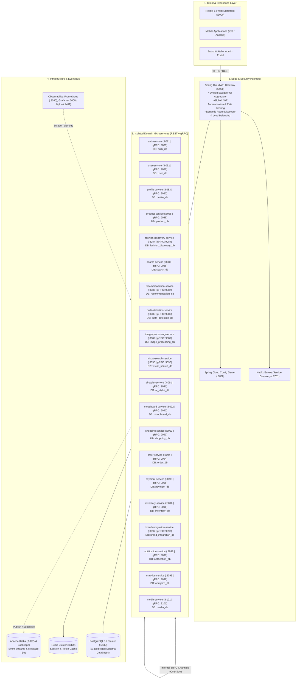

# Fashion Pin — Enterprise Microservices Architecture & Production Deployment Specification

> **Executive & Production Overview**: Cloud-native, high-scale visual fashion discovery, AI-curated aesthetic taxonomy, and headless luxury commerce platform engineered on a distributed Spring Boot 3 & Next.js 14 microservices architecture. Fully containerized with dedicated per-service databases, inter-service gRPC RPC channels, Kafka event streaming, and unified Swagger/OpenAPI documentation.

---

## 🌐 Live Production Deployment on Contabo Cloud VPS

The complete enterprise backend is deployed and running live on **Contabo Cloud VPS (Ubuntu 24.04 LTS)**:

| System / Component | Live URL / Endpoint | Credentials / Purpose |
| :--- | :--- | :--- |
| **Central Swagger UI Hub** | [http://194.163.166.16:8080/swagger-ui.html](http://194.163.166.16:8080/swagger-ui.html) | Interactive API exploration for **all 20 microservices** |
| **API Gateway (Public Edge)** | `http://194.163.166.16:8080` | High-performance reverse proxy & JWT authentication |
| **Eureka Service Registry** | [http://194.163.166.16:8761](http://194.163.166.16:8761) | Real-time instance discovery & service health registry |
| **Grafana Monitoring** | [http://194.163.166.16:3000](http://194.163.166.16:3000) | Observability dashboards (`admin` / `admin`) |
| **Prometheus Telemetry** | [http://194.163.166.16:9090](http://194.163.166.16:9090) | Application metrics & system telemetry |
| **Zipkin Distributed Tracing** | [http://194.163.166.16:9411](http://194.163.166.16:9411) | Distributed request lifecycle tracing across microservices |

---

## 📑 Interactive Swagger & OpenAPI Documentation Matrix

Every microservice exposes both a direct interactive Swagger UI and unified aggregation through the central API Gateway:

```
┌────────────────────────────────────────────────────────────────────────────┐
│                  Central API Gateway Swagger UI Hub                       │
│             http://194.163.166.16:8080/swagger-ui.html                     │
│   (Select any microservice definition from top-right dropdown to test)    │
└────────────────────────────────────────────────────────────────────────────┘
```

| # | Microservice | Domain | REST Port | gRPC Port | Dedicated DB | Direct Swagger UI Link |
| :-: | :--- | :--- | :-: | :-: | :--- | :--- |
| **1** | **auth-service** | Identity & Security | `8081` | `9081` | `auth_db` | [Swagger UI :8081](http://194.163.166.16:8081/swagger-ui/index.html) |
| **2** | **user-service** | Accounts & Preferences | `8082` | `9082` | `user_db` | [Swagger UI :8082](http://194.163.166.16:8082/swagger-ui/index.html) |
| **3** | **profile-service** | Social Graph & Style DNA | `8083` | `9083` | `profile_db` | [Swagger UI :8083](http://194.163.166.16:8083/swagger-ui/index.html) |
| **4** | **fashion-discovery-service** | Visual Feed & Taxonomy | `8084` | `9084` | `fashion_discovery_db` | [Swagger UI :8084](http://194.163.166.16:8084/swagger-ui/index.html) |
| **5** | **product-service** | Catalog, SKUs & Categories | `8085` | `9085` | `product_db` | [Swagger UI :8085](http://194.163.166.16:8085/swagger-ui/index.html) |
| **6** | **search-service** | Multi-Faceted Catalog Search | `8086` | `9086` | `search_db` | [Swagger UI :8086](http://194.163.166.16:8086/swagger-ui/index.html) |
| **7** | **recommendation-service** | AI Personalization Matrix | `8087` | `9087` | `recommendation_db` | [Swagger UI :8087](http://194.163.166.16:8087/swagger-ui/index.html) |
| **8** | **outfit-detection-service** | Garment Segmentation | `8088` | `9088` | `outfit_detection_db` | [Swagger UI :8088](http://194.163.166.16:8088/swagger-ui/index.html) |
| **9** | **image-processing-service** | Chromatic Processing | `8089` | `9089` | `image_processing_db` | [Swagger UI :8089](http://194.163.166.16:8089/swagger-ui/index.html) |
| **10** | **visual-search-service** | Vector Similarity Search | `8090` | `9090` | `visual_search_db` | [Swagger UI :8090](http://194.163.166.16:8090/swagger-ui/index.html) |
| **11** | **ai-stylist-service** | Generative Stylist Chat | `8091` | `9091` | `ai_stylist_db` | [Swagger UI :8091](http://194.163.166.16:8091/swagger-ui/index.html) |
| **12** | **moodboard-service** | Visual Curation & Pins | `8092` | `9092` | `moodboard_db` | [Swagger UI :8092](http://194.163.166.16:8092/swagger-ui/index.html) |
| **13** | **shopping-service** | Cart, Wishlists & Bundles | `8093` | `9093` | `shopping_db` | [Swagger UI :8093](http://194.163.166.16:8093/swagger-ui/index.html) |
| **14** | **order-service** | Order State Machine | `8094` | `9094` | `order_db` | [Swagger UI :8094](http://194.163.166.16:8094/swagger-ui/index.html) |
| **15** | **payment-service** | Payment Gateways & Ledger | `8095` | `9095` | `payment_db` | [Swagger UI :8095](http://194.163.166.16:8095/swagger-ui/index.html) |
| **16** | **inventory-service** | Real-Time Stock Locking | `8096` | `9096` | `inventory_db` | [Swagger UI :8096](http://194.163.166.16:8096/swagger-ui/index.html) |
| **17** | **brand-integration-service**| Brand Onboarding & B2B | `8097` | `9097` | `brand_integration_db` | [Swagger UI :8097](http://194.163.166.16:8097/swagger-ui/index.html) |
| **18** | **notification-service** | Push Alerts & WebSockets | `8098` | `9098` | `notification_db` | [Swagger UI :8098](http://194.163.166.16:8098/swagger-ui/index.html) |
| **19** | **analytics-service** | Clickstream & GMV Metrics | `8099` | `9099` | `analytics_db` | [Swagger UI :8099](http://194.163.166.16:8099/swagger-ui/index.html) |
| **20** | **media-service** | Object Storage & Asset CDN | `8101` | `9101` | `media_db` | [Swagger UI :8101](http://194.163.166.16:8101/swagger-ui/index.html) |

---

## 🏛️ System Architecture Diagram



---

## ⚡ Key Technical Innovations & Architecture Patterns

### 1. Database-Per-Service Isolation Pattern
- **Strict Data Segregation**: Every microservice owns a dedicated, fully isolated PostgreSQL database. No service is permitted direct SQL access to another service's tables.
- **Automated Flyway Schema Migrations**: Each service manages its schema lifecycle through declarative version-controlled Flyway migrations (`V1__init_schema.sql`, `V2__...`).
- **Connection Pool Optimization**: Configured HikariCP pools with fine-tuned PostgreSQL `max_connections=300` and `shared_buffers=256MB` for concurrent stability.

### 2. Hybrid Synchronous & Asynchronous Communication
- **Synchronous In-Network gRPC**: Ultra-low-latency inter-service remote procedure calls operate on dedicated protobuf contracts across ports `9081`–`9101`.
- **Asynchronous Kafka Event Driven Bus**: Domain events (e.g. `OrderCreatedEvent`, `UserRegisteredEvent`, `StockLockedEvent`) are published asynchronously to partitioned Kafka topics with consumer idempotency and outbox event tables.

### 3. Edge Routing & Security Perimeter
- **Spring Cloud API Gateway**: Central ingress point managing SSL termination, CORS pre-flight, rate limiting, and dynamic JWT claim verification.
- **Dynamic Service Discovery**: Netflix Eureka dynamically registers container IP instances with automated health checks, renewal leases, and zero-downtime routing.
- **Spring Cloud Config Server**: Centralized Git/Native environment configurations for dynamic property reloading without service redeployment.

### 4. Enterprise Observability & Health Monitoring
- **Prometheus & Micrometer**: Scrapes real-time application metrics, JVM heap/GC metrics, Tomcat thread pools, and HTTP request throughput from `/actuator/prometheus`.
- **Grafana Visualization**: Pre-provisioned dashboards for system health, CPU/RAM utilization, and API latency percentiles.
- **Zipkin Distributed Tracing**: Complete W3C / B3 distributed trace propagation capturing request spans across the gateway and microservices.

---

## 🚀 Quickstart & Server Management

### Connecting to the Production Server
```bash
ssh root@194.163.166.16
```

### Managing the Microservices Stack
The stack is managed via Docker Compose and auto-restarts on system boot via systemd:
```bash
# Navigate to application directory
cd /opt/fashionpin/backend

# Check container status
docker compose ps

# View live logs of a specific service
docker compose logs -f auth-service

# Restart the entire stack
systemctl restart fashionpin

# Check system memory & CPU load
htop
free -h
```

### Building & Running Locally
```bash
# 1. Clone repository
git clone https://github.com/YeamimHossainSajid/FashionPinBackend.git
cd FashionPinBackend

# 2. Build all microservices in parallel
./mvnw clean package -DskipTests -T 1C

# 3. Start local Docker Compose environment
docker compose up -d
```

### 🚦 Running k6 Load Tests through API Gateway
A full-featured k6 load test suite is located in `load-tests/`:
```bash
cd load-tests

# Quick smoke test against local API Gateway
./run-tests.sh --scenario smoke

# Instant 400 Concurrent Users Burst Test (hitting at the exact same moment)
k6 run quick-400-vus.js
# Or target local gateway:
# k6 run -e GATEWAY_URL=http://localhost:8080 quick-400-vus.js

# Production load test against live Contabo VPS
./run-tests.sh --scenario load --target http://194.163.166.16:8080

# 400 Sustained Concurrent Users for 30 Seconds against live Contabo VPS
./run-tests.sh --scenario load --vus 400 --duration 30s --target http://194.163.166.16:8080

# Stress test (pushing breaking points)
./run-tests.sh --scenario stress --vus 250 --duration 5m

# Run inside Docker
./run-tests.sh --docker --scenario smoke
```
Results and interactive visual HTML reports are automatically generated in `load-tests/reports/summary.html`.
See [`load-tests/README.md`](file:///Users/sajid/Documents/FashionPinFullStack/FashionPinBackend/load-tests/README.md) for full scenario configurations.

---

## 🪣 S3 Object Storage Infrastructure (MinIO)

FashionPin utilizes high-performance, S3-compatible **MinIO Object Storage** deployed with dedicated SSD persistence volumes on the Contabo infrastructure.

- **S3 API Endpoint**: `http://194.163.166.16:9000`
- **MinIO Web Console**: [http://194.163.166.16:9001](http://194.163.166.16:9001)
  - **Username**: `minioadmin`
  - **Password**: `FashionPinS3SecureKey2026!`
- **Auto-Provisioned Buckets**:
  - `fashionpin-media`: General media uploads and user attachments
  - `fashionpin-products`: Luxury catalog photography and high-res garment assets
  - `fashionpin-pins`: Social Pinterest-style pin visual assets and tags
  - `fashionpin-avatars`: User avatars and atelier profile banners
  - `fashionpin-tryon`: AI-generated virtual try-on renders and segmented masks

---

## 🔒 Security & Firewall Configurations

The Contabo production host is secured via **Ubuntu UFW**:
- **Port 22**: SSH Remote Administration
- **Port 8080**: API Gateway & Central Swagger UI
- **Port 8761**: Eureka Discovery Dashboard
- **Port 9000**: MinIO S3 API Endpoint
- **Port 9001**: MinIO Web Console
- **Port 3000**: Grafana Monitoring
- **Port 9090**: Prometheus Metrics
- **Port 9411**: Zipkin Distributed Tracing
- **Ports 8081–8101**: Microservice Direct REST & Swagger Documentation
- **Internal Only**: PostgreSQL (`5432`), Redis (`6379`), Kafka (`9092`), and Zookeeper (`2181`) are shielded from public internet exposure and accessible only via the internal bridge network `fashionpin-net`.
