# Fashion Pin — Enterprise Microservices Architecture & Database Specification

> **Executive & Investor Overview**: Cloud-native, high-scale visual fashion discovery, AI-curated aesthetic taxonomy, and headless luxury commerce platform engineered on a distributed Spring Boot 3 & Next.js 14 microservices architecture.

---

## 1. Total System Architecture Diagram (All 21 Microservices)

The Fashion Pin platform separates concerns into 8 dedicated functional domains communicating via high-performance synchronous REST/gRPC and asynchronous Apache Kafka event pipelines.

```mermaid
graph TB
    subgraph Client_Experience_Layer ["1. Client & Experience Layer"]
        WebStorefront["Next.js 14 SSR/SSG Storefront & Curation Web App (:3000)<br/>(Tailwind CSS, Radix UI, Framer Motion, Lucide)"]
        MobileClient["Mobile Native Applications (iOS / Android)"]
        AtelierPortal["Designer Brand & Atelier Admin Portal"]
    end

    subgraph Edge_Security_Perimeter ["2. Edge & Security Perimeter"]
        APIGateway["Spring Cloud API Gateway (:8080)<br/>• JWT Authentication & Rate Limiter<br/>• Global CORS & SSL Termination<br/>• Dynamic Route Discovery & Load Balancing"]
        EurekaRegistry["Netflix Eureka Service Discovery (:8761)"]
        ConfigServer["Spring Cloud Config Server (:8888)"]
    end

    subgraph Identity_Domain ["3. Identity & User Domain"]
        AuthService["auth-service (:8081)<br/>• auth_db<br/>• OAuth2/JWT Tokens, Rotation"]
        UserService["user-service (:8082)<br/>• user_db<br/>• Accounts & Preferences"]
        ProfileService["profile-service (:8083)<br/>• profile_db<br/>• Social Graph & Style DNA"]
    end

    subgraph Catalog_Media_Domain ["4. Product Catalog & Media Domain"]
        ProductService["product-service (:8085)<br/>• product_db<br/>• Silhouettes, SKUs, Collections"]
        BrandService["brand-integration-service (:8098)<br/>• brand_integration_db<br/>• Designer Onboarding"]
        MediaService["media-service (:8101)<br/>• media_db<br/>• Cloud Object Storage & CDN"]
    end

    subgraph AI_Vision_Domain ["5. Visual AI & Computer Vision Domain"]
        FashionDiscoveryService["fashion-discovery-service (:8084)<br/>• fashion_discovery_db<br/>• Infinite Feed Algorithms"]
        SearchService["search-service (:8086)<br/>• search_db<br/>• Multi-faceted Search Engine"]
        RecommendationService["recommendation-service (:8087)<br/>• recommendation_db<br/>• Personalization Matrix"]
        OutfitDetectionService["outfit-detection-service (:8088)<br/>• outfit_detection_db<br/>• Garment Segmentation"]
        ImageProcessingService["image-processing-service (:8089)<br/>• image_processing_db<br/>• Chromatic Processing"]
        VisualSearchService["visual-search-service (:8090)<br/>• visual_search_db<br/>• Vector Similarity Search"]
        AIStylistService["ai-stylist-service (:8091)<br/>• ai_stylist_db<br/>• Generative Stylist Chat"]
        VirtualTryOnService["virtual-tryon-service (:8092)<br/>• virtual_tryon_db<br/>• AI Fitting Room Engine"]
    end

    subgraph Curation_Domain ["6. Social Curation & Moodboard Domain"]
        MoodboardService["moodboard-service (:8093)<br/>• moodboard_db<br/>• Infinite Visual Canvas & Pins"]
    end

    subgraph Commerce_Fulfillment_Domain ["7. Commerce & Fulfillment Domain"]
        ShoppingService["shopping-service (:8094)<br/>• shopping_db<br/>• Shopping Cart & Wishlists"]
        OrderService["order-service (:8095)<br/>• order_db<br/>• Order State Machine"]
        PaymentService["payment-service (:8096)<br/>• payment_db<br/>• Stripe & Payment Gateways"]
        InventoryService["inventory-service (:8097)<br/>• inventory_db<br/>• Real-time SKU Stock Lock"]
    end

    subgraph Platform_Analytics_Domain ["8. Analytics & Notification Domain"]
        NotificationService["notification-service (:8099)<br/>• notification_db<br/>• WebSockets & Push Alerts"]
        AnalyticsService["analytics-service (:8100)<br/>• analytics_db<br/>• Clickstream & GMV Analytics"]
    end

    subgraph Event_Data_Tier ["Distributed Data & Event Infrastructure"]
        PostgresCluster[("PostgreSQL 18 Multi-Database Cluster<br/>(Render Cloud / Managed Cloud DB)")]
        RedisCluster[("Redis Cluster (:6379)<br/>• Rate Limits & Storefront Session Cache")]
        KafkaCluster[("Apache Kafka Event Stream (:9092)<br/>• Topics: fashionpin.*.events")]
    end

    WebStorefront -->|HTTPS / REST| APIGateway
    MobileClient -->|HTTPS / REST| APIGateway
    AtelierPortal -->|HTTPS / REST| APIGateway

    APIGateway --> EurekaRegistry
    APIGateway --> ConfigServer

    APIGateway -->|Route lb://auth-service| AuthService
    APIGateway -->|Route lb://user-service| UserService
    APIGateway -->|Route lb://profile-service| ProfileService
    APIGateway -->|Route lb://product-service| ProductService
    APIGateway -->|Route lb://brand-integration-service| BrandService
    APIGateway -->|Route lb://media-service| MediaService
    APIGateway -->|Route lb://fashion-discovery-service| FashionDiscoveryService
    APIGateway -->|Route lb://search-service| SearchService
    APIGateway -->|Route lb://recommendation-service| RecommendationService
    APIGateway -->|Route lb://visual-search-service| VisualSearchService
    APIGateway -->|Route lb://ai-stylist-service| AIStylistService
    APIGateway -->|Route lb://virtual-tryon-service| VirtualTryOnService
    APIGateway -->|Route lb://moodboard-service| MoodboardService
    APIGateway -->|Route lb://shopping-service| ShoppingService
    APIGateway -->|Route lb://order-service| OrderService
    APIGateway -->|Route lb://payment-service| PaymentService
    APIGateway -->|Route lb://inventory-service| InventoryService
    APIGateway -->|Route lb://notification-service| NotificationService
    APIGateway -->|Route lb://analytics-service| AnalyticsService

    AuthService -.->|Events| KafkaCluster
    ProductService -.->|Events| KafkaCluster
    MoodboardService -.->|Events| KafkaCluster
    OrderService -.->|Events| KafkaCluster
    PaymentService -.->|Events| KafkaCluster

    AuthService --> PostgresCluster
    UserService --> PostgresCluster
    ProfileService --> PostgresCluster
    ProductService --> PostgresCluster
    BrandService --> PostgresCluster
    MediaService --> PostgresCluster
    MoodboardService --> PostgresCluster
    ShoppingService --> PostgresCluster
    OrderService --> PostgresCluster
    PaymentService --> PostgresCluster
    InventoryService --> PostgresCluster
    NotificationService --> PostgresCluster
    AnalyticsService --> PostgresCluster
    VisualSearchService --> PostgresCluster

    APIGateway --> RedisCluster
    ProductService --> RedisCluster
```



---

## 2. Total Enterprise Entity-Relationship Diagram (ERD)

The diagram below reflects the complete relational architecture spanning all independent microservice databases in the FashionPin platform.

```mermaid
erDiagram
    %% ==================== IDENTITY DOMAIN ====================
    USERS ||--|| USER_PROFILES : "has profile"
    USERS ||--o{ USER_SESSIONS : "authenticates"
    USERS ||--o{ USER_FOLLOWS : "follows"
    USER_PROFILES ||--o{ STYLE_DNA_AFFINITIES : "exhibits"

    USERS {
        varchar(64) id PK
        varchar(100) email UK
        varchar(100) username UK
        varchar(255) password_hash
        varchar(32) role
        varchar(32) status
        timestamp created_at
        timestamp updated_at
    }

    USER_PROFILES {
        varchar(64) id PK
        varchar(64) user_id FK,UK
        varchar(100) display_name
        text bio
        varchar(500) avatar_url
        varchar(500) cover_url
        varchar(100) location
        varchar(32) tier_rank
        boolean is_verified
        timestamp updated_at
    }

    USER_FOLLOWS {
        varchar(64) follower_id PK,FK
        varchar(64) following_id PK,FK
        timestamp created_at
    }

    %% ==================== CATALOG & BRAND DOMAIN ====================
    BRANDS ||--o{ PRODUCTS : "manufactures"
    CATEGORIES ||--o{ ITEM_TYPES : "contains silhouettes"
    CATEGORIES ||--o{ PRODUCTS : "classifies"
    ITEM_TYPES ||--o{ PRODUCTS : "sub-classifies"
    PRODUCTS ||--|{ PRODUCT_VARIANTS : "has SKUs"
    PRODUCTS ||--o{ COLLECTION_PRODUCTS : "curated into"
    COLLECTIONS ||--o{ COLLECTION_PRODUCTS : "features"

    BRANDS {
        varchar(64) id PK
        varchar(150) name
        varchar(150) slug UK
        text description
        varchar(500) logo_url
        varchar(500) banner_url
        varchar(32) tier
        boolean is_verified
        timestamp created_at
    }

    CATEGORIES {
        varchar(64) id PK
        varchar(100) name
        varchar(100) slug UK
        text description
        varchar(64) parent_id FK
        int display_order
        boolean is_active
        varchar(500) banner_media_url
        timestamp created_at
    }

    ITEM_TYPES {
        varchar(64) id PK
        varchar(64) category_id FK
        varchar(100) name
        varchar(100) slug
        text description
        int display_order
        boolean is_active
        varchar(500) size_guide_url
    }

    COLLECTIONS {
        varchar(64) id PK
        varchar(150) name
        varchar(150) slug UK
        varchar(255) tagline
        text description
        varchar(500) hero_media_url
        varchar(32) accent_color
        int display_order
        boolean is_featured
        boolean is_active
        timestamp created_at
    }

    PRODUCTS {
        varchar(64) id PK
        varchar(64) brand_id FK
        varchar(64) category_id FK
        varchar(64) item_type_id FK
        varchar(255) name
        varchar(255) slug UK
        varchar(500) summary
        text description
        varchar(64) category
        varchar(64) subcategory
        varchar(32) status
        decimal price
        varchar(3) currency
        varchar(500) primary_media_id
        text media_ids
        varchar(32) gender
        timestamp created_at
    }

    PRODUCT_VARIANTS {
        varchar(64) id PK
        varchar(64) product_id FK
        varchar(100) sku UK
        varchar(64) color_name
        varchar(16) color_hex
        varchar(32) size
        decimal price_override
        int stock_quantity
        varchar(500) media_ids
        boolean is_active
    }

    COLLECTION_PRODUCTS {
        varchar(64) collection_id PK,FK
        varchar(64) product_id PK,FK
        int display_order
        varchar(255) curator_note
        timestamp added_at
    }

    %% ==================== CURATION & MOODBOARD DOMAIN ====================
    USERS ||--o{ MOODBOARDS : "curates"
    MOODBOARDS ||--o{ MOODBOARD_ITEMS : "contains"
    MOODBOARDS ||--o{ MOODBOARD_COLLABORATORS : "shares with"
    PRODUCTS ||--o{ MOODBOARD_ITEMS : "pinned as"

    MOODBOARDS {
        varchar(64) id PK
        varchar(64) user_id FK
        varchar(150) title
        varchar(150) slug
        text description
        varchar(500) cover_image_url
        boolean is_public
        boolean is_collaborative
        int view_count
        timestamp created_at
        timestamp updated_at
    }

    MOODBOARD_ITEMS {
        varchar(64) id PK
        varchar(64) moodboard_id FK
        varchar(64) product_id FK
        varchar(64) media_id
        decimal position_x
        decimal position_y
        decimal width
        decimal height
        decimal rotation
        int z_index
        text note
        timestamp created_at
    }

    MOODBOARD_COLLABORATORS {
        varchar(64) moodboard_id PK,FK
        varchar(64) user_id PK,FK
        varchar(32) permission_role
        timestamp joined_at
    }

    %% ==================== COMMERCE & ORDER DOMAIN ====================
    USERS ||--o{ SHOPPING_CARTS : "owns"
    SHOPPING_CARTS ||--o{ CART_ITEMS : "contains"
    USERS ||--o{ ORDERS : "places"
    ORDERS ||--|{ ORDER_ITEMS : "contains"
    ORDERS ||--|| PAYMENT_TRANSACTIONS : "paid via"
    PRODUCT_VARIANTS ||--o{ INVENTORY_STOCKS : "tracked in"

    SHOPPING_CARTS {
        varchar(64) id PK
        varchar(64) user_id FK,UK
        decimal total_amount
        varchar(3) currency
        timestamp updated_at
    }

    CART_ITEMS {
        varchar(64) id PK
        varchar(64) cart_id FK
        varchar(64) product_id FK
        varchar(64) variant_id FK
        int quantity
        decimal unit_price
        timestamp added_at
    }

    ORDERS {
        varchar(64) id PK
        varchar(64) user_id FK
        varchar(32) order_number UK
        varchar(32) order_status
        decimal subtotal_amount
        decimal tax_amount
        decimal shipping_amount
        decimal total_amount
        varchar(3) currency
        varchar(64) shipping_address_id
        timestamp placed_at
        timestamp updated_at
    }

    ORDER_ITEMS {
        varchar(64) id PK
        varchar(64) order_id FK
        varchar(64) product_id FK
        varchar(64) variant_id FK
        varchar(100) sku
        varchar(255) product_name
        int quantity
        decimal unit_price
        decimal total_price
    }

    PAYMENT_TRANSACTIONS {
        varchar(64) id PK
        varchar(64) order_id FK,UK
        varchar(64) payment_method
        varchar(100) transaction_reference
        varchar(32) status
        decimal amount
        varchar(3) currency
        varchar(255) error_message
        timestamp processed_at
    }

    INVENTORY_STOCKS {
        varchar(64) id PK
        varchar(64) variant_id FK,UK
        int quantity_available
        int quantity_reserved
        int safety_threshold
        varchar(64) warehouse_location
        timestamp updated_at
    }

    %% ==================== VISUAL AI & VISION DOMAIN ====================
    PRODUCTS ||--o{ VISUAL_EMBEDDINGS : "vectorized into"

    VISUAL_EMBEDDINGS {
        varchar(64) id PK
        varchar(64) product_id FK
        varchar(64) media_id
        varchar(64) model_version
        text embedding_vector
        varchar(64) dominant_color
        timestamp generated_at
    }
```



---

## 3. Comprehensive Database Architecture Schemas (By Microservice)

### 3.1 `auth-service` Database (`auth_db`)
Manages authentication credentials, JWT token lifecycle, and role-based permissions.

#### `users` Table
| Column | Type | Constraints | Description |
| :--- | :--- | :--- | :--- |
| `id` | `VARCHAR(64)` | `PRIMARY KEY` | User UUID |
| `email` | `VARCHAR(100)` | `NOT NULL, UNIQUE` | User email address |
| `username` | `VARCHAR(100)` | `NOT NULL, UNIQUE` | Unique handle (e.g. `@elenavance`) |
| `password_hash`| `VARCHAR(255)` | `NOT NULL` | BCrypt encrypted password hash |
| `role` | `VARCHAR(32)` | `DEFAULT 'ROLE_USER'` | `ROLE_USER`, `ROLE_BRAND`, `ROLE_ADMIN` |
| `status` | `VARCHAR(32)` | `DEFAULT 'ACTIVE'` | `ACTIVE`, `SUSPENDED`, `PENDING_VERIFY` |
| `created_at` | `TIMESTAMP` | `NOT NULL` | Registration timestamp |
| `updated_at` | `TIMESTAMP` | `NOT NULL` | Last update timestamp |

#### `refresh_tokens` Table
| Column | Type | Constraints | Description |
| :--- | :--- | :--- | :--- |
| `id` | `VARCHAR(64)` | `PRIMARY KEY` | Token record UUID |
| `user_id` | `VARCHAR(64)` | `NOT NULL, FK -> users(id)` | Associated user |
| `token_hash` | `VARCHAR(255)` | `NOT NULL, UNIQUE` | Cryptographic SHA-256 token hash |
| `expires_at` | `TIMESTAMP` | `NOT NULL` | Token expiry timestamp |
| `is_revoked` | `BOOLEAN` | `DEFAULT FALSE` | Revocation status |

---

### 3.2 `profile-service` Database (`profile_db`)
Manages creator profile metadata, style aesthetic affinities, and social follower graphs.

#### `user_profiles` Table
| Column | Type | Constraints | Description |
| :--- | :--- | :--- | :--- |
| `id` | `VARCHAR(64)` | `PRIMARY KEY` | Profile UUID |
| `user_id` | `VARCHAR(64)` | `NOT NULL, UNIQUE` | Associated User ID |
| `display_name` | `VARCHAR(100)` | `NOT NULL` | Public curator name |
| `bio` | `TEXT` | `NULLABLE` | Editorial curator biography |
| `avatar_url` | `VARCHAR(500)` | `NULLABLE` | Profile picture asset URL |
| `cover_url` | `VARCHAR(500)` | `NULLABLE` | Profile header cover asset URL |
| `location` | `VARCHAR(100)` | `NULLABLE` | Atelier location (e.g. Paris / Milan) |
| `tier_rank` | `VARCHAR(32)` | `DEFAULT 'Tier I'` | Curator ranking tier |
| `is_verified` | `BOOLEAN` | `DEFAULT FALSE` | Verified gold badge indicator |
| `updated_at` | `TIMESTAMP` | `NOT NULL` | Last modified timestamp |

#### `user_follows` Table
| Column | Type | Constraints | Description |
| :--- | :--- | :--- | :--- |
| `follower_id` | `VARCHAR(64)` | `PRIMARY KEY` | User ID who follows |
| `following_id`| `VARCHAR(64)` | `PRIMARY KEY` | User ID being followed |
| `created_at` | `TIMESTAMP` | `DEFAULT NOW()` | Timestamp follow initiated |

---

### 3.3 `product-service` Database (`product_db`)
Core catalog database powering demographic categories, silhouette item types, aesthetic hubs, garments, and SKU variants.

#### `categories` Table
| Column | Type | Constraints | Description |
| :--- | :--- | :--- | :--- |
| `id` | `VARCHAR(64)` | `PRIMARY KEY` | Category ID (`cat_men`, `cat_women`, `cat_kids`) |
| `name` | `VARCHAR(100)` | `NOT NULL` | Demographics title (e.g. `Men's Fashion`) |
| `slug` | `VARCHAR(100)` | `NOT NULL, UNIQUE` | Route URL slug (`men`, `women`, `kids`) |
| `description` | `TEXT` | `NULLABLE` | Editorial category manifesto |
| `parent_id` | `VARCHAR(64)` | `FK -> categories(id)` | Nested tree hierarchy parent |
| `display_order`| `INT` | `DEFAULT 0` | Navigation order |
| `banner_media_url`| `VARCHAR(500)`| `NULLABLE` | 4K editorial banner visual |
| `is_active` | `BOOLEAN` | `DEFAULT TRUE` | Activation toggle |

#### `item_types` Table
| Column | Type | Constraints | Description |
| :--- | :--- | :--- | :--- |
| `id` | `VARCHAR(64)` | `PRIMARY KEY` | Silhouette ID (`it_m_pants`, `it_w_dresses`) |
| `category_id` | `VARCHAR(64)` | `NOT NULL, FK -> categories(id)` | Parent category relation |
| `name` | `VARCHAR(100)` | `NOT NULL` | Silhouette label (`Wide-Leg Trousers`) |
| `slug` | `VARCHAR(100)` | `NOT NULL` | Subcategory filter key |
| `display_order`| `INT` | `DEFAULT 0` | Display sorting priority |
| `is_active` | `BOOLEAN` | `DEFAULT TRUE` | Active switch |

#### `collections` Table
| Column | Type | Constraints | Description |
| :--- | :--- | :--- | :--- |
| `id` | `VARCHAR(64)` | `PRIMARY KEY` | Collection ID (e.g. `col_old_money`) |
| `name` | `VARCHAR(150)` | `NOT NULL` | Collection name (*Old Money, Minimal Luxe, Street Couture, Quiet Luxury, Dark Academia, Coastal Chic*) |
| `slug` | `VARCHAR(150)` | `NOT NULL, UNIQUE` | Aesthetic URL route slug |
| `tagline` | `VARCHAR(255)` | `NULLABLE` | Short editorial summary tagline |
| `description` | `TEXT` | `NULLABLE` | Complete aesthetic philosophy |
| `hero_media_url`| `VARCHAR(500)`| `NULLABLE` | Editorial hero campaign image URL |
| `accent_color`| `VARCHAR(32)` | `DEFAULT '#000000'` | Brand hex color theme for UI accenting |
| `is_featured` | `BOOLEAN` | `DEFAULT FALSE` | Homepage spotlight flag |

#### `products` Table
| Column | Type | Constraints | Description |
| :--- | :--- | :--- | :--- |
| `id` | `VARCHAR(64)` | `PRIMARY KEY` | Product ID (`mp-1`, `wp-1`, UUID) |
| `brand_id` | `VARCHAR(64)` | `NOT NULL` | Designer atelier / brand reference |
| `category_id` | `VARCHAR(64)` | `FK -> categories(id)` | Category relation |
| `item_type_id`| `VARCHAR(64)` | `FK -> item_types(id)` | Silhouette relation |
| `name` | `VARCHAR(255)` | `NOT NULL` | Product title |
| `slug` | `VARCHAR(255)` | `NOT NULL, UNIQUE` | PDP URL slug |
| `summary` | `VARCHAR(500)` | `NULLABLE` | Short card summary |
| `description` | `TEXT` | `NULLABLE` | Fabric & craftsmanship details |
| `category` | `VARCHAR(64)` | `NOT NULL` | Flat indexed category key |
| `subcategory` | `VARCHAR(64)` | `NULLABLE` | Flat indexed silhouette key |
| `status` | `VARCHAR(32)` | `NOT NULL` | `ACTIVE`, `DRAFT`, `ARCHIVED` |
| `price` | `DECIMAL(12,2)`| `NOT NULL` | Catalog retail price in USD |
| `currency` | `VARCHAR(3)` | `DEFAULT 'USD'` | Currency code |
| `primary_media_id`| `VARCHAR(500)`| `NULLABLE` | Primary high-res product photo URL |
| `media_ids` | `TEXT` | `NULLABLE` | Comma-delimited gallery photo URLs |
| `gender` | `VARCHAR(32)` | `NULLABLE` | `Men`, `Women`, `Unisex`, `Kids` |
| `created_at` | `TIMESTAMP` | `NOT NULL` | Creation timestamp |

#### `product_variants` Table
| Column | Type | Constraints | Description |
| :--- | :--- | :--- | :--- |
| `id` | `VARCHAR(64)` | `PRIMARY KEY` | Unique variant UUID |
| `product_id` | `VARCHAR(64)` | `NOT NULL, FK -> products(id)` | Parent product link |
| `sku` | `VARCHAR(100)` | `NOT NULL, UNIQUE` | Stock Keeping Unit identifier |
| `color_name` | `VARCHAR(64)` | `NOT NULL` | Color name (e.g. `Oatmeal Beige`) |
| `color_hex` | `VARCHAR(16)` | `DEFAULT '#222222'` | Swatch color hex code |
| `size` | `VARCHAR(32)` | `NOT NULL` | Size specification (e.g. `38R`, `M`, `42`) |
| `price_override`| `DECIMAL(12,2)`| `NULLABLE` | Size/color specific price override |
| `stock_quantity`| `INT` | `DEFAULT 0` | Available stock units |
| `is_active` | `BOOLEAN` | `DEFAULT TRUE` | Variant availability switch |

#### `collection_products` Table
| Column | Type | Constraints | Description |
| :--- | :--- | :--- | :--- |
| `collection_id`| `VARCHAR(64)` | `PRIMARY KEY, FK -> collections(id)` | Collection FK |
| `product_id` | `VARCHAR(64)` | `PRIMARY KEY, FK -> products(id)` | Product FK |
| `display_order`| `INT` | `DEFAULT 0` | Sequence inside collection |
| `curator_note` | `VARCHAR(255)`| `NULLABLE` | Stylist commentary |

---

### 3.4 `moodboard-service` Database (`moodboard_db`)
Powers interactive 2D visual moodboards, draggable sticker canvas layers, and collaborative curation.

#### `moodboards` Table
| Column | Type | Constraints | Description |
| :--- | :--- | :--- | :--- |
| `id` | `VARCHAR(64)` | `PRIMARY KEY` | Moodboard UUID |
| `user_id` | `VARCHAR(64)` | `NOT NULL` | Owner User ID |
| `title` | `VARCHAR(150)` | `NOT NULL` | Moodboard title (e.g. *Parisian Autumn Tailoring*) |
| `slug` | `VARCHAR(150)` | `NOT NULL` | Public URL slug |
| `description` | `TEXT` | `NULLABLE` | Aesthetic description & notes |
| `cover_image_url`| `VARCHAR(500)`| `NULLABLE` | Rendered canvas preview thumbnail |
| `is_public` | `BOOLEAN` | `DEFAULT TRUE` | Public vs Private Vault switch |
| `is_collaborative`| `BOOLEAN` | `DEFAULT FALSE` | Multi-user editing switch |
| `view_count` | `INT` | `DEFAULT 0` | Total community impressions |

#### `moodboard_items` Table
| Column | Type | Constraints | Description |
| :--- | :--- | :--- | :--- |
| `id` | `VARCHAR(64)` | `PRIMARY KEY` | Item UUID on canvas |
| `moodboard_id`| `VARCHAR(64)` | `NOT NULL, FK -> moodboards(id)` | Parent moodboard |
| `product_id` | `VARCHAR(64)` | `NULLABLE` | Linked product garment |
| `media_id` | `VARCHAR(64)` | `NULLABLE` | Custom user image asset reference |
| `position_x` | `DECIMAL(8,2)` | `NOT NULL` | X-coordinate on infinite canvas |
| `position_y` | `DECIMAL(8,2)` | `NOT NULL` | Y-coordinate on infinite canvas |
| `width` | `DECIMAL(8,2)` | `NOT NULL` | Element rendered width |
| `height` | `DECIMAL(8,2)` | `NOT NULL` | Element rendered height |
| `rotation` | `DECIMAL(5,2)` | `DEFAULT 0.0` | Angular rotation in degrees |
| `z_index` | `INT` | `DEFAULT 1` | Layer stacking index |
| `note` | `TEXT` | `NULLABLE` | Stylist annotation / sticky note |

---

### 3.5 `shopping-service` Database (`shopping_db`)
Manages active customer cart sessions, selected variants, and item quantities.

#### `shopping_carts` Table
| Column | Type | Constraints | Description |
| :--- | :--- | :--- | :--- |
| `id` | `VARCHAR(64)` | `PRIMARY KEY` | Shopping Cart UUID |
| `user_id` | `VARCHAR(64)` | `NOT NULL, UNIQUE` | Customer ID |
| `total_amount` | `DECIMAL(12,2)`| `DEFAULT 0.00` | Current cart value |
| `currency` | `VARCHAR(3)` | `DEFAULT 'USD'` | Currency code |
| `updated_at` | `TIMESTAMP` | `NOT NULL` | Last activity timestamp |

#### `cart_items` Table
| Column | Type | Constraints | Description |
| :--- | :--- | :--- | :--- |
| `id` | `VARCHAR(64)` | `PRIMARY KEY` | Cart item UUID |
| `cart_id` | `VARCHAR(64)` | `NOT NULL, FK -> shopping_carts(id)` | Parent cart reference |
| `product_id` | `VARCHAR(64)` | `NOT NULL` | Product reference |
| `variant_id` | `VARCHAR(64)` | `NOT NULL` | SKU variant reference |
| `quantity` | `INT` | `NOT NULL, CHECK (quantity > 0)` | Selected quantity |
| `unit_price` | `DECIMAL(12,2)`| `NOT NULL` | Snapshot unit price |

---

### 3.6 `order-service` Database (`order_db`)
Fulfillment state machine tracking checkouts, tax, shipments, and customer order history.

#### `orders` Table
| Column | Type | Constraints | Description |
| :--- | :--- | :--- | :--- |
| `id` | `VARCHAR(64)` | `PRIMARY KEY` | Order UUID |
| `user_id` | `VARCHAR(64)` | `NOT NULL` | Customer ID |
| `order_number` | `VARCHAR(32)` | `NOT NULL, UNIQUE` | Human-readable order code (e.g. `FP-2026-9812`) |
| `order_status` | `VARCHAR(32)` | `NOT NULL` | `PENDING`, `PAID`, `FULFILLING`, `SHIPPED`, `DELIVERED`, `CANCELLED` |
| `subtotal_amount`| `DECIMAL(12,2)`| `NOT NULL` | Line item subtotal |
| `tax_amount` | `DECIMAL(12,2)`| `DEFAULT 0.00` | Calculated sales tax |
| `shipping_amount`| `DECIMAL(12,2)`| `DEFAULT 0.00` | Express / White Glove shipping fee |
| `total_amount` | `DECIMAL(12,2)`| `NOT NULL` | Final total billed |
| `currency` | `VARCHAR(3)` | `DEFAULT 'USD'` | Currency |
| `placed_at` | `TIMESTAMP` | `NOT NULL` | Order submission timestamp |

#### `order_items` Table
| Column | Type | Constraints | Description |
| :--- | :--- | :--- | :--- |
| `id` | `VARCHAR(64)` | `PRIMARY KEY` | Order line UUID |
| `order_id` | `VARCHAR(64)` | `NOT NULL, FK -> orders(id)` | Order parent relation |
| `product_id` | `VARCHAR(64)` | `NOT NULL` | Product ID |
| `variant_id` | `VARCHAR(64)` | `NOT NULL` | Variant SKU ID |
| `sku` | `VARCHAR(100)` | `NOT NULL` | SKU code |
| `product_name` | `VARCHAR(255)` | `NOT NULL` | Snapshot product name |
| `quantity` | `INT` | `NOT NULL` | Purchased units |
| `unit_price` | `DECIMAL(12,2)`| `NOT NULL` | Billed unit price |
| `total_price` | `DECIMAL(12,2)`| `NOT NULL` | Total line price |

---

### 3.7 `payment-service` Database (`payment_db`)
Secure payment gateway ledger managing transactions, idempotency keys, and refunds.

#### `payment_transactions` Table
| Column | Type | Constraints | Description |
| :--- | :--- | :--- | :--- |
| `id` | `VARCHAR(64)` | `PRIMARY KEY` | Transaction UUID |
| `order_id` | `VARCHAR(64)` | `NOT NULL, UNIQUE` | Linked order ID |
| `payment_method`| `VARCHAR(64)` | `NOT NULL` | `STRIPE_CREDIT_CARD`, `APPLE_PAY`, `KLARNA` |
| `transaction_reference`| `VARCHAR(100)`| `NOT NULL, UNIQUE` | Gateway transaction ID (e.g. `ch_3M...`) |
| `status` | `VARCHAR(32)` | `NOT NULL` | `SUCCEEDED`, `PENDING`, `FAILED`, `REFUNDED` |
| `amount` | `DECIMAL(12,2)`| `NOT NULL` | Billed amount |
| `currency` | `VARCHAR(3)` | `DEFAULT 'USD'` | Currency |
| `processed_at` | `TIMESTAMP` | `NOT NULL` | Gateway settlement timestamp |

---

### 3.8 `inventory-service` Database (`inventory_db`)
Real-time inventory levels, safety thresholds, and distributed checkout reservation locks.

#### `inventory_stocks` Table
| Column | Type | Constraints | Description |
| :--- | :--- | :--- | :--- |
| `id` | `VARCHAR(64)` | `PRIMARY KEY` | Stock record UUID |
| `variant_id` | `VARCHAR(64)` | `NOT NULL, UNIQUE` | Linked Product Variant SKU |
| `quantity_available`| `INT` | `NOT NULL, DEFAULT 0` | Unreserved stock on hand |
| `quantity_reserved`| `INT` | `NOT NULL, DEFAULT 0` | Stock locked during active checkouts |
| `safety_threshold`| `INT` | `DEFAULT 5` | Low stock alert trigger level |
| `warehouse_location`| `VARCHAR(64)`| `NULLABLE` | Warehouse rack / bin identifier |
| `updated_at` | `TIMESTAMP` | `NOT NULL` | Last sync timestamp |

---

### 3.9 `visual-search-service` Database (`visual_search_db`)
Vector embeddings, garment feature vectors, and chromatic profiles powering visual similarity.

#### `visual_embeddings` Table
| Column | Type | Constraints | Description |
| :--- | :--- | :--- | :--- |
| `id` | `VARCHAR(64)` | `PRIMARY KEY` | Vector record UUID |
| `product_id` | `VARCHAR(64)` | `NOT NULL` | Linked catalog product |
| `media_id` | `VARCHAR(64)` | `NOT NULL` | Visual image reference |
| `model_version`| `VARCHAR(64)` | `NOT NULL` | Vision encoder model version (e.g. `ViT-L/14`) |
| `embedding_vector`| `TEXT` | `NOT NULL` | 512-dim / 768-dim float array vector |
| `dominant_color`| `VARCHAR(64)` | `NULLABLE` | Primary chromatic centroid |
| `generated_at` | `TIMESTAMP` | `NOT NULL` | Generation timestamp |

---

## 4. Asynchronous Kafka Event-Driven Architecture

Microservices communicate state changes across decoupled Apache Kafka event topics using the Transactional Outbox pattern:

| Domain | Topic Name | Publishing Service | Consuming Services | Event Payload Description |
| :--- | :--- | :--- | :--- | :--- |
| **Auth** | `fashionpin.auth.user-registered` | `auth-service` | `user-service`, `profile-service`, `notification-service` | Trigger profile skeleton creation and welcome digest |
| **Catalog**| `fashionpin.catalog.product-created` | `product-service` | `search-service`, `visual-search-service`, `analytics-service` | Re-index product search facets & compute visual vectors |
| **Curation**| `fashionpin.curation.pin-saved` | `moodboard-service` | `recommendation-service`, `analytics-service` | Update user Style DNA affinity scores & trending feeds |
| **Commerce**| `fashionpin.order.order-placed` | `order-service` | `inventory-service`, `payment-service`, `notification-service` | Lock stock units & initiate payment capture |
| **Payment**| `fashionpin.payment.payment-succeeded` | `payment-service` | `order-service`, `analytics-service`, `notification-service` | Advance order state to `PAID` & trigger email invoice |

---

## 5. Documentation & Developer Runbook

Full maintainer documentation lives under [`docs/`](./docs/README.md):

| Need | Doc |
|------|-----|
| Local setup / daily workflow | [docs/DEVELOPER_GUIDE.md](./docs/DEVELOPER_GUIDE.md) |
| Add a new microservice | [docs/ADDING_A_SERVICE.md](./docs/ADDING_A_SERVICE.md) |
| Profiles, env vars, DB names | [docs/ENVIRONMENT_AND_PROFILES.md](./docs/ENVIRONMENT_AND_PROFILES.md) |
| Gateway URL map | [docs/GATEWAY_ROUTES.md](./docs/GATEWAY_ROUTES.md) |
| Kafka topics / events | [docs/KAFKA_AND_EVENTS.md](./docs/KAFKA_AND_EVENTS.md) |
| What security actually does | [docs/SECURITY.md](./docs/SECURITY.md) |
| When something breaks | [docs/TROUBLESHOOTING.md](./docs/TROUBLESHOOTING.md) |
| Generator script dangers | [docs/CODE_GENERATION.md](./docs/CODE_GENERATION.md) |
| Why decisions were made | [docs/adr/](./docs/adr/) |


Full maintainer docs live under [`docs/`](./docs/README.md):

| Need | Doc |
|------|-----|
| Local setup / daily workflow | [docs/DEVELOPER_GUIDE.md](./docs/DEVELOPER_GUIDE.md) |
| Add a new microservice | [docs/ADDING_A_SERVICE.md](./docs/ADDING_A_SERVICE.md) |
| Profiles, env vars, DB names | [docs/ENVIRONMENT_AND_PROFILES.md](./docs/ENVIRONMENT_AND_PROFILES.md) |
| Gateway URL map | [docs/GATEWAY_ROUTES.md](./docs/GATEWAY_ROUTES.md) |
| Kafka topics / events | [docs/KAFKA_AND_EVENTS.md](./docs/KAFKA_AND_EVENTS.md) |
| What security actually does | [docs/SECURITY.md](./docs/SECURITY.md) |
| When something breaks | [docs/TROUBLESHOOTING.md](./docs/TROUBLESHOOTING.md) |
| Generator script dangers | [docs/CODE_GENERATION.md](./docs/CODE_GENERATION.md) |
| Why decisions were made | [docs/adr/](./docs/adr/) |

## 5. Architecture Overview

- Microservices with independent Maven modules
- Domain-oriented service boundaries
- Event-driven communication via Apache Kafka
- Synchronous communication via OpenFeign and gRPC placeholders
- Service discovery with Netflix Eureka
- Edge routing with Spring Cloud Gateway
- Centralized configuration with Spring Cloud Config
- Database-per-service with PostgreSQL
- Observability with Actuator, Micrometer, Prometheus, Grafana, and Zipkin

```text
Clients
   |
   v
API Gateway (JWT/Auth/Rate-limit placeholders, CORS, logging)
   |
   +--> Eureka Discovery
   |
   +--> Config Server
   |
   +--> Domain Services (auth, user, product, search, AI, commerce, ...)
          |                |
          | Kafka events   | Feign / gRPC
          v                v
     Brokers/Topics   Peer services
```

## Tech Stack

Java 21, Spring Boot 3.3.x, Spring Cloud 2023.0.x, Spring Security, Gateway, Eureka, Config Server, Actuator, JPA, PostgreSQL, Redis, Kafka, Docker, gRPC, OpenFeign, MapStruct, Lombok, Validation, OpenAPI, Micrometer, Prometheus, Grafana, Zipkin, JUnit 5, Testcontainers, Maven.

## Modules

| Service | Port | Database |
|---------|------|----------|
| `discovery-service` | 8761 | n/a |
| `config-server` | 8888 | n/a |
| `api-gateway` | 8080 | n/a |
| `auth-service` | 8081 | auth_db |
| `user-service` | 8082 | user_db |
| `profile-service` | 8083 | profile_db |
| `fashion-discovery-service` | 8084 | fashion_discovery_db |
| `product-service` | 8085 | product_db |
| `search-service` | 8086 | search_db |
| `recommendation-service` | 8087 | recommendation_db |
| `outfit-detection-service` | 8088 | outfit_detection_db |
| `image-processing-service` | 8089 | image_processing_db |
| `visual-search-service` | 8090 | visual_search_db |
| `ai-stylist-service` | 8091 | ai_stylist_db |
| `virtual-tryon-service` | 8092 | virtual_tryon_db |
| `moodboard-service` | 8093 | moodboard_db |
| `shopping-service` | 8094 | shopping_db |
| `order-service` | 8095 | order_db |
| `payment-service` | 8096 | payment_db |
| `inventory-service` | 8097 | inventory_db |
| `brand-integration-service` | 8098 | brand_integration_db |
| `notification-service` | 8099 | notification_db |
| `analytics-service` | 8100 | analytics_db |
| `media-service` | 8101 | media_db |
| `common-lib` | n/a | shared DTOs/errors/events |

## Folder Structure

Each business service follows:

```text
src/main/java/com/fashionpin/<service>/
  config/
  controller/
  service/
  repository/
  entity/
  dto/
  mapper/
  security/
  exception/
  client/
  event/
  kafka/
  grpc/
  util/
  validation/
  health/
```

## How Services Communicate

1. **Client -> Gateway**: all external traffic enters through `api-gateway:8080`
2. **Gateway -> Services**: Eureka-backed `lb://service-name` routes
3. **Service -> Service (sync)**: OpenFeign clients and gRPC placeholders
4. **Service -> Service (async)**: Kafka topics under `fashionpin.*.events`
5. **Config**: optional Config Server (`CONFIG_ENABLED=true`) with `dev` / `test` / `prod` profiles

## Prerequisites

- **Java 21** (required; Lombok does not support newer JDKs for this foundation)
- Maven 3.9+
- Docker & Docker Compose

```bash
export JAVA_HOME=/opt/homebrew/opt/openjdk@21/libexec/openjdk.jdk/Contents/Home
export PATH="$JAVA_HOME/bin:$PATH"
```

## Build

```bash
./mvnw clean package -DskipTests
```

## Run locally (foundation profile)

Start infrastructure first (recommended):

```bash
docker compose up -d postgres redis zookeeper kafka zipkin discovery-service config-server
```

Then run a service:

```bash
./mvnw -pl discovery-service spring-boot:run
./mvnw -pl api-gateway spring-boot:run
./mvnw -pl user-service spring-boot:run
```

Dev profile uses in-memory H2 so services can boot without PostgreSQL for foundation smoke checks.
Kafka/Redis autoconfig is disabled in `dev`/`test` to keep local startup reliable.

## Docker instructions

```bash
# Build and start the full stack
docker compose up --build

# Start only platform dependencies
docker compose up -d postgres redis zookeeper kafka zipkin prometheus grafana discovery-service config-server api-gateway
```

Useful URLs:

- Eureka: http://localhost:8761
- Gateway health: http://localhost:8080/api/v1/health
- Config Server: http://localhost:8888
- Zipkin: http://localhost:9411
- Prometheus: http://localhost:9090
- Grafana: http://localhost:3000 (admin/admin)

## Health endpoints

Every service exposes:

- `/actuator/health`
- `/api/v1/health`
- `/actuator/prometheus`

Gateway example route:

```text
GET /api/v1/user/health  ->  user-service /api/v1/health
```

Because gateway discovery locator is enabled, services are also reachable as:

```text
GET /user-service/api/v1/health
```

## Security placeholders

- JWT filter placeholders in gateway and services
- Role-based authorization placeholder (`ROLE_ADMIN`, `ROLE_USER`)
- No production auth implementation yet

## Coding standards

- Constructor injection only
- No wildcard imports
- SOLID / clean architecture packaging
- Shared error model in `common-lib`
- Service-owned databases only

## Implementation Phases & Roadmap

- [x] **Phase 1: Identity & User Domain (Completed)**
  - Auth token issuance, password hashing, refresh token rotation & revocation (`auth-service`).
  - Event-driven user creation & profile initialization (`user-service`, `profile-service`).
  - Gateway routes & JWT security foundation (`api-gateway`).
  - Transactional Outbox pattern & consumer idempotency.

- [x] **Phase 2: Product Catalog & Visual Media Domain (Completed)**
  - Hexagonal object storage abstraction & media metadata lifecycle (`media-service`).
  - Brand catalog integration & provider abstractions (`brand-integration-service`).
  - Product catalog aggregates with fashion attributes, OpenFeign validation, & Redis caching (`product-service`).
  - Gateway routes & outbox events (`MediaCreated`, `BrandCreated`, `ProductCreated`, etc.).

- [ ] **Phase 3: Moodboards & Social Graph Domain (Remaining TODO)**
  - User follow/following graph & social interactions (`profile-service`).
  - Curation moodboards, saved pins, and collections (`moodboard-service`).

- [ ] **Phase 4: AI & Computer Vision Domain (Remaining TODO)**
  - Visual search & image processing pipeline (`visual-search-service`, `image-processing-service`).
  - AI stylist recommendation engine (`ai-stylist-service`).
  - Virtual try-on engine (`virtual-tryon-service`).

- [ ] **Phase 5: Commerce, Orders & Payments (Remaining TODO)**
  - Shopping cart & bag (`shopping-service`).
  - Order checkout & processing (`order-service`).
  - Payment gateway integration (`payment-service`).

## License

Proprietary - Fashion Pin startup foundation.
